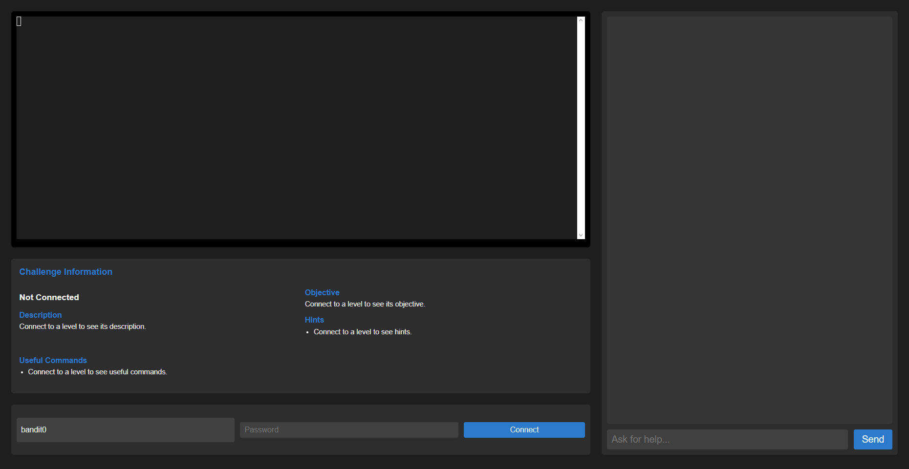

# BanditGUI - A Web-Based GUI for OverTheWire Bandit

BanditGUI is a web application that provides a graphical user interface for the OverTheWire Bandit wargame. It simplifies the learning process by offering an integrated terminal, level-specific instructions and hints, a helpful chat assistant, and progress tracking.

## Features

* **Integrated Web Terminal:** Interact with the Bandit levels directly within your browser.
* **Level Instructions and Hints:** Get clear guidance for each level, including objectives, descriptions, and hints.
* **AI-Powered Chat Assistant:** Ask questions, get command explanations, and receive contextual help without revealing the answers.
* **Progress Tracking:** Monitor your progress through the Bandit levels.
* **Password Management:** Securely store and retrieve discovered passwords.

## Screenshots



## Installation

1. **Clone the repository:**

   ```bash
   git clone https://github.com/TheRealFredP3D/BanditGUI.git
   cd BanditGUI
   ```

2. **Install dependencies:**

   ```bash
   pip install -r requirements.txt
   ```

3. **Set up environment variables:**
   Create a `.env` file in the project root and add your API key for the chat assistant (if using an external API):

   ```
   GITHUB_API_KEY=your_api_key_here
   ```

4. **Run the application:**

   ```bash
   python app.py
   ```

5. **Open in your browser:**
   Navigate to `http://127.0.0.1:5000/`

## Usage

1. Select a Bandit level from the level selection menu.
2. Use the integrated terminal to execute commands and solve the challenges.
3. Interact with the chat assistant for hints and guidance.
4. Track your progress as you complete the levels.

## Roadmap

This project is actively under development. Here's a roadmap of potential improvements and new features:

* **Complete Level Data:** Add complete information for all 34 Bandit levels to `bandit_levels.json`.
* **Enhanced Chat Assistant:**
  * Integrate a more powerful NLP model (e.g., OpenAI's GPT) for more intelligent and contextual responses.
  * Fine-tune the model on Bandit-specific data for better performance.
  * Add support for more complex queries and interactions.
* **Improved Error Handling:** Provide more specific and user-friendly error messages.
* **Dynamic Level Loading:**  Load level data dynamically from the JSON file for easier updates and management.
* **User Authentication:** Implement user authentication to store individual progress and preferences.
* **Frontend Enhancements:**
  * Improve the web interface with better styling and more interactive elements.
  * Visualize user progress through the levels.
* **Integrated Command History:** Store and display the user's command history within the web terminal.
* **Challenge Completion Verification:** Automatically verify if a user has completed a level based on specific criteria.
* **Dockerization:** Create a Dockerfile for easier deployment and portability.
* **Vulnerability Explanations:** Provide explanations of the vulnerabilities exploited in each level.
* **Multiple Language Support:** Add support for different languages for instructions and hints.

## Contributing

Contributions are welcome! Please feel free to open issues and submit pull requests.

## License

This project is licensed under the MIT License. See the [LICENSE](LICENSE) file for details.

```


This README provides a more comprehensive overview of the project, including installation and usage instructions, and a roadmap for future development.  Remember to replace `"your_api_key_here"` with your actual API key (and consider how best to manage secrets long-term, perhaps using a secrets store).  A LICENSE file should also be created with your chosen license terms.


