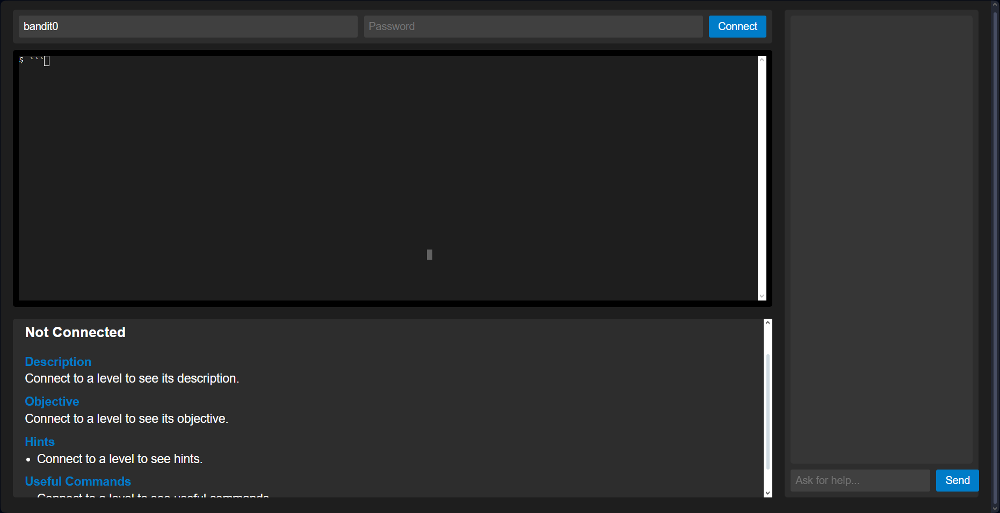

# BanditGUI

This is a Flask-based web application that allows users to connect to SSH servers, execute commands, and manage passwords for different levels. The application uses Flask-SocketIO for real-time communication between the server and the client.

---



## Features

-Connect to SSH servers using a username and password.  
-Execute SSH commands and display the output in real-time.  
-Automatically detect and save passwords from command outputs.  
-Track user progress through different levels.  
-Basic chat functionality with a placeholder for AI chat responses.  

---

## Installation

Clone the repository:

```Bash
# Insert in terminal

git clone <https://github.com/yourusername/ssh-manager-app.git>
cd ssh-manager-app

# Create a virtual environment and activate it:

python3 -m venv venv
source venv/bin/activate

# Install the required packages:

pip install -r requirements.txt

#Run the application:

python app.py
```

Open your web browser and navigate to <http://localhost:5000>.

---

## Usage

Navigate to the home page to see the list of available levels.
Connect to an SSH server by providing a username and password.
Execute commands in the terminal and see the output in real-time.
Progress through levels by finding and saving passwords.

---

## Roadmap

### Version 1.1

**AI Chat Response**: Implement AI-based responses for the chat functionality.
User Authentication: Add user authentication to save progress across sessions.

**Enhanced UI**: Improve the user interface for a better user experience.

### Version 1.2

**Multi-User Support**: Allow multiple users to connect and interact simultaneously.

**Command History**: Implement a feature to save and display the history of executed commands.

**Level Hints**: Provide hints for each level to assist users in solving challenges.

### Version 1.3

**Mobile Support**: Optimize the application for mobile devices.

**Advanced Analytics**: Add analytics to track user progress and command usage.

**Custom Levels**: Allow users to create and share custom levels.

---

## Contributing

Contributions are welcome! Please fork the repository and submit a pull request with your changes. Make sure to follow the coding standards and include appropriate tests.

## License

This project is licensed under the MIT License. See the LICENSE file for details.

## Contact

For any questions or suggestions, please open an issue on GitHub or contact the project maintainer at <fredp3d@proton.me>.

Thank you for using the SSH Manager Application! We hope it helps you manage your SSH connections and passwords effectively.
