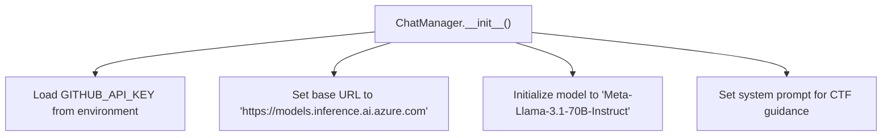

# BanditGUI - chat_manager.py

```mermaid
flowchart TD
    A["ChatManager.__init__()"] --> B["Load GITHUB_API_KEY from environment"]
    A --> C["Set base URL to 'https://models.inference.ai.azure.com'"]
    A --> D["Initialize model to 'Meta-Llama-3.1-70B-Instruct'"]
    A --> E["Set system prompt for CTF guidance"]
```
