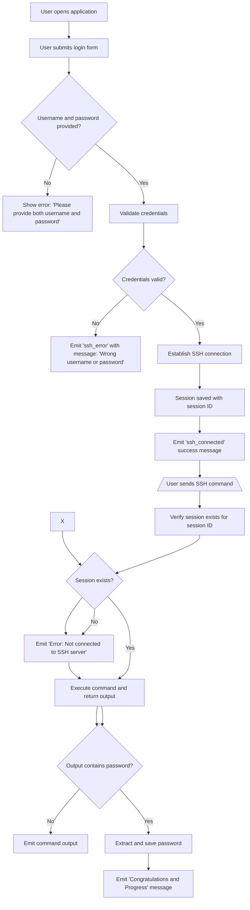

# BanditGUI - Flowchart: Login Form

```mermaid
flowchart TD
    A["User opens application"] --> B["User submits login form"]
    B --> C{"Username and password provided?"}
    C -->|No| D["Show error: 'Please provide both username and password'"]
    C -->|Yes| E["Validate credentials"]

    E --> F{"Credentials valid?"}
    F -->|No| G["Emit 'ssh_error' with message: 'Wrong username or password'"]
    F -->|Yes| H["Establish SSH connection"]
    H --> I["Session saved with session ID"]

    I --> J["Emit 'ssh_connected' success message"]
    
    X --> M["Disconnection requested"]
    M --> N["Close SSH connection"]
    N --> O["Remove session using session ID"]
    O --> P["Emit 'session closed' message"]

    J --> K[/"User sends SSH command"\]
    K --> L["Verify session exists for session ID"]
    L --> M{"Session exists?"}
    M -->|No| N["Emit 'Error: Not connected to SSH server'"]
    M -->|Yes| O["Execute command and return output"]
    O --> P{"Output contains password?"}
    P -->|No| Q["Emit command output"]
    P -->|Yes| R["Extract and save password"]
    R --> S["Emit 'Congratulations and Progress' message"]
```
