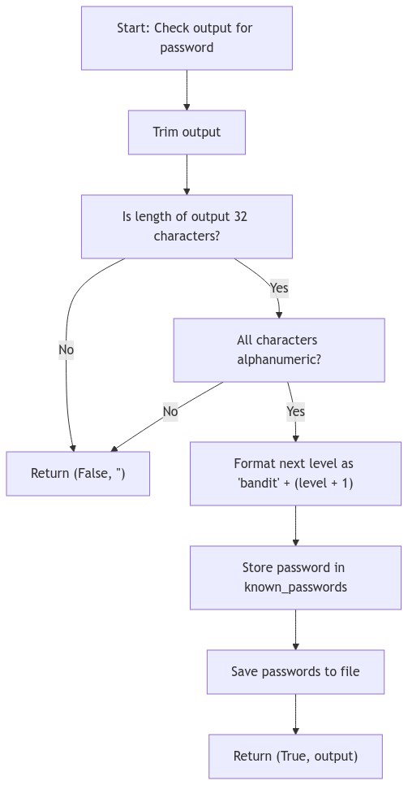

# BanditGUI - Flowchart: Monitor Output For Password

Following is a Mermaid Flowchart that illustrates the process of the `check_output_for_password` method:

This flowchart represents the decision-making process involved in verifying and validating output against predetermined password criteria.
