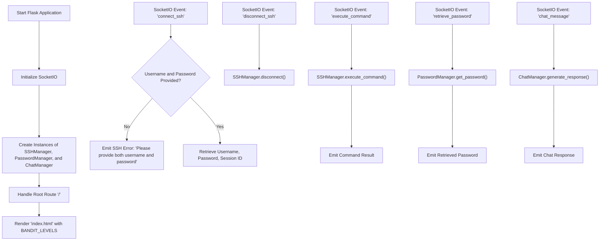

BanditGUI - SocketIO Events

This Mermaid flowchart illustrates the SocketIO events and their corresponding actions in the BanditGUI application. The application is built using Flask and SocketIO, and it interacts with three main classes: **SSHManager**, **PasswordManager**, and **ChatManager**.

