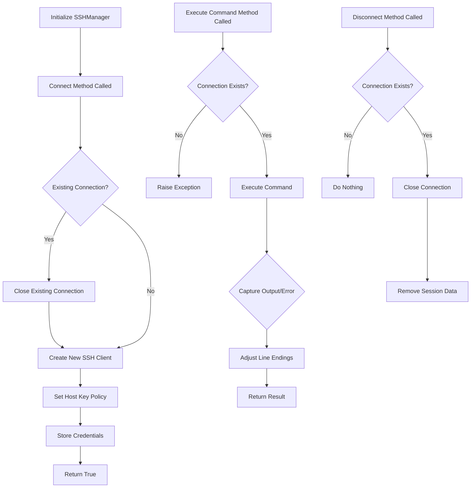

# BanditGUI - Flowchart

## ssh_manager.py

Here's a flowchart diagram representation of the SSH management workflow using the `SSHManager` class:

This flowchart outlines the steps taken during the execution of methods in the `SSHManager` class, including connection management, command execution, and disconnection procedures.
